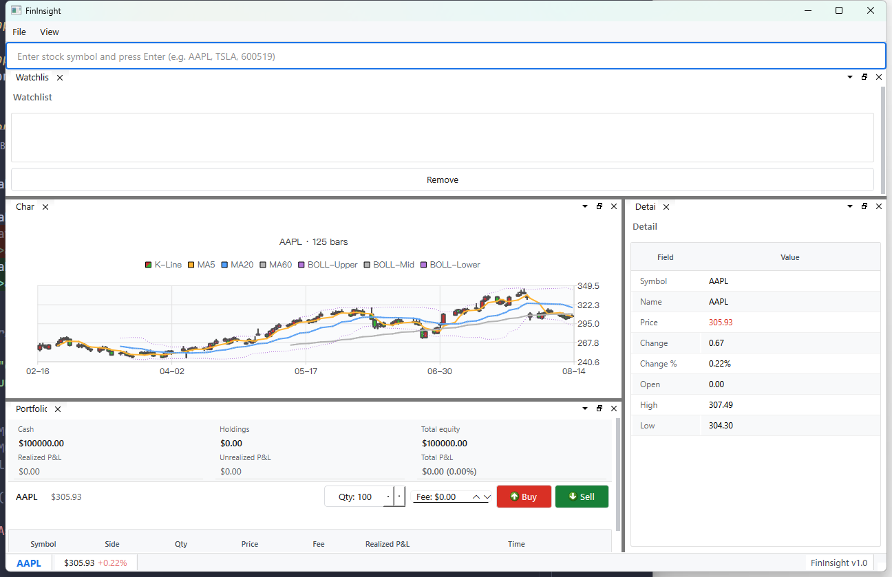

# FinInsight

> 基于 C++17 + Qt 6 的桌面金融数据终端 —— 行情监控 · K 线图表 · 技术指标 · 模拟交易 · 投资实验复盘

[](https://isocpp.org/)
[](https://www.qt.io/)
[](https://cmake.org/)
[](https://sqlite.org/)
[](LICENSE)



---

## 项目简介

FinInsight 是一个个人独立开发的桌面金融数据终端：行情监控、K 线图表与技术指标、自选股、模拟撮合交易与风控、投资实验复盘等模块，以可拖拽多面板（Qt ADS）方式集成。

项目侧重工程实践：网络层 / 行情中枢 / 业务模型 / UI 面板分层解耦，核心业务逻辑（指标引擎、撮合账本、风控、表达式引擎）均为零 Qt 依赖的纯 C++，可独立单元测试。

## 功能特性

- **多面板工作台**：9 个业务面板（自选股 / 详情 / K 线 / 模拟组合 / 实时交易 / 投资实验 / 通知 / 健康监控 / 搜索），基于 Qt ADS 自由拖拽、停靠、分屏
- **行情数据管道**：线程安全的进程内发布订阅（DataHub），面板按主题订阅、支持通配符匹配；多数据源（Yahoo Finance / EastMoney）适配器异步发布，晚订阅面板自动回放补齐
- **实时行情推送**：WebSocket 长连接接入实时报价，心跳保活 + 断线指数退避自动重连，连接状态机管理、行情超时自动降级备用源
- **K 线图表**：Qt Charts 自定义渲染，缩放限界、双击复位、十字光标、点击选时点标记，与详情 / 交易面板联动
- **技术指标引擎**：纯 C++ 实现 MA / EMA / BOLL / RSI / MACD，零 UI 依赖、可独立单测
- **DSL 表达式引擎**：自研「词法 → 递归下降语法分析 → AST → 求值」完整链路（`std::variant` 表达语法树节点），支持 K 线字段与指标的比较 / 逻辑运算，已接入详情面板「策略体检」（如 `MACD>0 AND RSI(14)<30`）
- **模拟交易与风控**：纯 C++ 撮合账本（平均成本法结算已实现盈亏）+ 事前风控引擎（订单规模 / 单票敞口 / 日内订单数 / 日内亏损 / 行情时效 / kill switch）
- **数据持久化**：SQLite WAL 模式 + 版本化迁移（V1–V4）+ 模板化数据访问层，自选股 / 交易订单 / 实验快照落库
- **国际化**：全局中 / 英一键切换（I18n 单例）

## 架构

```
FinInsight/
├── src/
│   ├── main.cpp              # 应用入口（浅色主题初始化）
│   ├── app/                  # 主窗口、面板编排、DSL 求值接线
│   ├── core/                 # 基础设施（AppConfig 配置、I18n 国际化）
│   ├── market/               # 领域模型（证券元数据、代码解析、报价规则）
│   ├── network/              # 网络通信（HttpClient / WebSocketClient 心跳重连）
│   ├── datahub/              # 数据中枢（发布订阅管道、多源适配器、实时行情流）
│   ├── charts/               # 图表（K 线渲染、技术指标引擎）
│   ├── dsl/                  # 表达式引擎（Lexer / Parser / Evaluator）
│   ├── trading/              # 交易（下单服务、风控引擎、模拟撮合网关）
│   ├── simulation/           # 模拟（撮合账本、历史价格序列、投资实验）
│   ├── storage/              # 持久化（SQLite 封装、迁移、Repository 模板）
│   ├── monitoring/           # 健康与延迟监控
│   ├── notifications/        # 通知服务
│   └── panels/               # 业务面板（9 个）
├── tests/                    # 单元测试（core 纯逻辑 / Qt 面板交互）
├── docs/                     # 设计与模块文档
└── resources/                # 图标资源
```

**依赖方向**：`network / datahub / charts / trading / simulation` 不依赖 UI；`panels` 只消费数据；`core / storage` 被各层共用。

## 技术栈

| 层级 | 技术 |
|------|------|
| 语言 | C++17/20（optional / variant / 模板 / 多线程） |
| UI 框架 | Qt 6.7（Widgets + Charts + Network + WebSockets + Sql） |
| 可停靠布局 | Qt Advanced Docking System |
| 构建系统 | CMake 3.27 + Ninja（MSVC / MinGW 双预设） |
| 数据库 | SQLite（WAL 模式，一写多读） |
| 序列化 | nlohmann/json |
| 数据源 | Yahoo Finance（HTTP + WebSocket）/ EastMoney |
| 测试 | Qt Test + 纯 C++ 单元测试 |

## 构建与运行

### 环境要求

- Qt 6.7+（MSVC 2022 64-bit 或 MinGW 套件）
- CMake 3.27+ / Ninja
- 编译器：MSVC 19.40+ 或 MinGW GCC 11+

### 构建步骤

```powershell
# 1. 克隆
git clone https://github.com/sunflower023/FinInsight.git
cd FinInsight

# 2. 修改 CMakePresets.json 中的 CMAKE_PREFIX_PATH 指向你的 Qt 安装路径

# 3. 构建（二选一）
.\build.bat          # MSVC + Ninja（win-dev 预设）
.\build-mingw.bat    # MinGW + Ninja（win-mingw 预设）

# 4. 运行
.\build\win-dev\src\FinInsight.exe
```

> 中国大陆网络环境拉取 FetchContent 依赖（Qt ADS / nlohmann json）可能需要配置代理。

## 模块总览

| 模块 | 说明 | 状态 |
|------|------|------|
| 主窗口 + 可拖拽面板 | Qt ADS 停靠布局，9 个业务面板 | ✅ |
| 多源数据管道 | Yahoo / EastMoney 适配器 + 聚合去重 | ✅ |
| DataHub 发布订阅 | 线程安全、通配符主题匹配、replayLast 回放 | ✅ |
| WebSocket 实时行情 | 长连接 + 心跳 + 指数退避重连 + 状态机降级 | ✅ |
| K 线图 | Qt Charts 自定义渲染与交互 | ✅ |
| 技术指标引擎 | MA / EMA / BOLL / RSI / MACD，纯 C++ | ✅ |
| DSL 表达式引擎 | 词法 / 递归下降 / AST 求值，已接入「策略体检」 | ✅ |
| 模拟交易 | 撮合账本 + 持仓净值 + 历史价买卖 | ✅ |
| 风控引擎 | 订单规模 / 敞口 / 日内亏损 / 行情时效 / kill switch | ✅ |
| SQLite 数据层 | WAL + 版本化迁移（V1–V4）+ Repository 模板 | ✅ |
| 国际化 | 中 / 英全局切换 | ✅ |
| 健康监控 / 通知 | 延迟统计与事件通知面板 | ✅ |

## 文档

- [快速上手与数据流](docs/QUICKSTART.md)
- [整体架构](docs/PROJECT_ARCHITECTURE.md)
- [模块文档](docs/)：DATAHUB / CHARTS / STORAGE / SIMULATION / DSL / PANELS

## License

[MIT](LICENSE) © 2026
