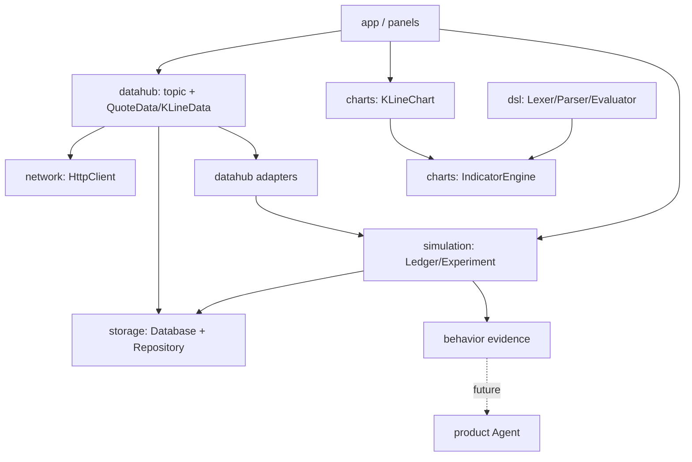

# Architecture Notes

## 分层



UI 负责展示和编排；DataHub 负责进程内数据分发；Producer 负责外部数据适配；Network 只负责传输；Storage 只负责持久化；指标算法尽量保持纯 C++。
模拟交易和历史实验必须只通过 `simulation` 领域模块计算，PortfolioPanel 不得保留第二套成交规则。历史 K 线先经 `HistoricalPriceAdapter` 和纯 C++ `HistoricalPriceSeries` 校验，再进入实验模块。产品 Agent 只消费已保存的证据，不参与成交、估值或行情源选择。

## Topic 约定

- `<symbol>.quote`：单个 `QuoteData`。
- `<symbol>.kline.daily`：`QVector<KLineData>`。
- `*.quote`：所有股票报价的通配订阅。

规划中的实时主题：

- `<symbol>.quote.realtime`：WebSocket 或其他实时流规范化后的 `QuoteData`。
- Yahoo 实验性 streamer 已能发布该主题；它仍是独立实时源，尚未替换 Yahoo HTTP 股票报价主链路。

发布者不应直接持有面板指针；面板在析构前必须取消订阅。回调在 DataHub 锁外执行，回调中允许再次订阅或发布。

## 当前真实链路

```text
MainWindow -> YahooProducer -> HttpClient(getAsync) -> Yahoo Finance
           -> DataHub -> Detail/StockList/KLineChart
PortfolioPanel 已接收 MainWindow 的当前标的和报价，并仅通过 Ledger 完成模拟成交与估值；状态仍只保存在内存中。
Aggregator 仍未接入该主链路；HistoricalPriceAdapter 已接入 MainWindow 的历史实验链路。
```

## 目标业务链路

```text
KLineData -> HistoricalPriceAdapter -> HistoricalPriceSeries
          -> InvestmentExperiment -> result/risk -> Portfolio/Experiment UI
Trade input -> Ledger -> valuation -> SQLite snapshot -> evidence -> Agent
```

## 线程模型目标

当前版本以主线程 UI 为中心。后续网络重构建议：每个请求拥有明确的 QObject 所在线程，结果通过 signal/slot 或 queued connection 回到 UI；取消、超时和重试属于请求对象职责，不由 UI 自己维护事件循环。

SQLite 连接必须遵守 Qt SQL 的线程归属；不要在线程之间共享 `QSqlDatabase` 实例。

WebSocket 连接对象应归属于明确的 Qt 线程，通过 queued signal 将规范化数据交给
DataHub；重连、心跳和取消由连接层负责。Agent 调用不得阻塞 UI，也不得修改
账本状态。
