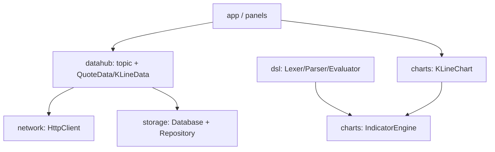

# Architecture Notes

## 分层

UI 负责展示和编排；DataHub 负责进程内数据分发；Producer 负责外部数据适配；Network 只负责传输；Storage 只负责持久化；指标算法尽量保持纯 C++。

## Topic 约定

- `<symbol>.quote`：单个 `QuoteData`。
- `<symbol>.kline.daily`：`QVector<KLineData>`。
- `*.quote`：所有股票报价的通配订阅。

发布者不应直接持有面板指针；面板在析构前必须取消订阅。回调在 DataHub 锁外执行，回调中允许再次订阅或发布。

## 线程模型目标

当前版本以主线程 UI 为中心。后续网络重构建议：每个请求拥有明确的 QObject 所在线程，结果通过 signal/slot 或 queued connection 回到 UI；取消、超时和重试属于请求对象职责，不由 UI 自己维护事件循环。

SQLite 连接必须遵守 Qt SQL 的线程归属；不要在线程之间共享 `QSqlDatabase` 实例。
