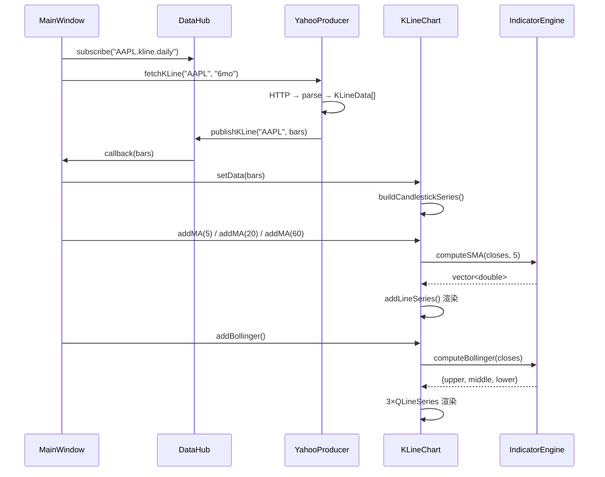

# Charts 模块文档

> 图表渲染层：技术指标计算引擎 + K 线图表 Widget

---

## 一、模块定位

```
IndicatorEngine            KLineChart
┌──────────────┐          ┌──────────────────┐
│ 纯 C++ 计算   │─────────▶│  Qt Charts 渲染   │
│ 零 Qt 依赖    │          │  蜡烛图 + 指标线   │
│ std::vector   │          │  QCandlestickSeries│
└──────────────┘          └──────────────────┘
    已实现 ✅                  已实现 ✅

---

## 二、为什么计算和渲染分开

```
原始数据 (OHLCV):
  2026-07-01  185.0  188.2  184.5  187.5  52,300,000
  2026-07-02  187.8  189.1  186.3  188.2  48,100,000
  ...

原始数据只有 5 列。图表上的 MA / MACD / RSI / BOLL 全部是计算出来的：

  MA5    = (前 5 天收盘价之和) / 5
  MACD   = EMA(12) - EMA(26)
  Signal = EMA(9, MACD)
  RSI    = 100 - 100/(1 + 平均涨幅/平均跌幅)
  BOLL   = SMA(20) ± 2 × 标准差
  KDJ    = 基于最高最低价的随机指标

IndicatorEngine 负责计算这些 → KLineChart 负责画到屏幕上
```

---

## 三、提供的指标

| 指标 | 方法 | 输入 | 输出 |
|------|------|------|------|
| 简单移动平均 | `computeSMA` | closes, 5 | `vector<double>` |
| 指数移动平均 | `computeEMA` | closes, 12 | `vector<double>` |
| MACD | `computeMACD` | closes, 12, 26, 9 | `{line, signal, histogram}` |
| RSI | `computeRSI` | closes, 14 | `vector<double>` |
| 布林带 | `computeBollinger` | closes, 20, 2.0 | `{upper, middle, lower}` |
| KDJ | `computeKDJ` | highs, lows, closes, 9 | `{k, d, j}` |
| 能量潮 | `computeOBV` | closes, volumes | `vector<double>` |

---

## 四、使用示例

```cpp
#include "charts/IndicatorEngine.h"
using namespace fininsight::charts;

// 准备收盘价数据
std::vector<double> closes = {185.0, 187.8, 186.3, 188.2, 189.1, 187.5};

// 计算 5 日均线
auto ma = computeSMA(closes, 5);  // → {0, 0, 0, 0, 187.28, 187.78}

// 计算 MACD（默认 12/26/9）
auto macd = computeMACD(closes);
// macd.line      = {0, ..., 1.23}
// macd.signal    = {0, ..., 0.98}
// macd.histogram = {0, ..., 0.50}  // (DIF-DEA)×2

// 计算 RSI（默认 14 日）
auto rsi = computeRSI(closes, 14);

// 计算布林带
auto boll = computeBollinger(closes, 20, 2.0);
// boll.upper  = 上轨
// boll.middle = 中轨(MA20)
// boll.lower  = 下轨
```

---

## 五、计算公式速查

### SMA (简单移动平均)
```
SMA(n) = (P₁ + P₂ + ... + Pₙ) / n
```

### EMA (指数移动平均)
```
α = 2 / (n + 1)
EMA_today = α × P_today + (1 - α) × EMA_yesterday
```

### MACD
```
DIF   = EMA(12) - EMA(26)
DEA   = EMA(9, DIF)
柱状  = (DIF - DEA) × 2
```

### RSI
```
涨幅 = Σmax(ΔP, 0) / n
跌幅 = Σmax(-ΔP, 0) / n
RS   = 涨幅 / 跌幅
RSI  = 100 - 100 / (1 + RS)
```

### 布林带
```
中轨 = SMA(n)
上轨 = 中轨 + k × σ
下轨 = 中轨 - k × σ
(σ = n 日标准差, k = 2.0)
```

### KDJ
```
RSV(n) = (Close - Low_n) / (High_n - Low_n) × 100
K = 2/3 × K_prev + 1/3 × RSV
D = 2/3 × D_prev + 1/3 × K
J = 3K - 2D
```

---

## 六、文件结构

```
src/charts/
├── IndicatorEngine.h       ← 公有接口（7 个计算函数）
└── IndicatorEngine.cpp     ← 纯数值实现（~180 行，零 Qt 依赖）
```

---

## 七、KLineChart — 图表渲染

### 架构

```
KLineChart (QChartView)
├── QChart
│   ├── QCandlestickSeries  ← K 线蜡烛（红涨绿跌）
│   ├── QLineSeries         ← MA5 橙色
│   ├── QLineSeries         ← MA20 蓝色
│   ├── QLineSeries         ← MA60 灰色
│   ├── QLineSeries × 3     ← BOLL 上/中/下 紫色点线
│   ├── QDateTimeAxis       ← X 轴：日期
│   └── QValueAxis          ← Y 轴：价格
├── 鼠标滚轮缩放
├── 右键拖拽平移
└── 内部调用 IndicatorEngine 计算指标
```

### 时序图



### 交互方式

| 操作 | 效果 |
|------|------|
| 鼠标滚轮 | 缩放（放大/缩小） |
| 右键拖拽 | 平移图表 |
| 左键框选 | Qt Charts 内置矩形缩放 |
| 点击图例 | 显示/隐藏对应指标线 |

### 代码示例

```cpp
// MainWindow.cpp 中的实际集成：
auto* chart = new KLineChart();
DataHub::instance().subscribe("AAPL.kline.daily",
    [chart](const QVariant& data) {
        auto bars = data.value<QVector<KLineData>>();
        chart->setData(bars);           // 画 K 线
        chart->addMA(5,  orange);      // 叠加 MA5
        chart->addMA(20, blue);        // 叠加 MA20
        chart->addMA(60, gray);        // 叠加 MA60
        chart->addBollinger();         // 叠加布林带
    });
```
