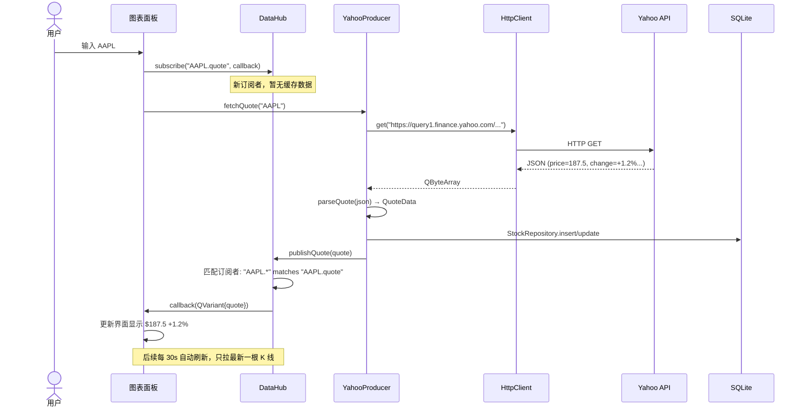

# DataHub 模块文档

> 数据管道层：发布订阅中枢 + HTTP 客户端 + 多数据源接入

---

## 一、模块结构

```
src/
├── network/
│   ├── HttpClient.h / .cpp      ← HTTP 请求封装（单例）
│
├── datahub/
│   ├── QuoteData.h              ← 行情数据结构体
│   ├── DataHub.h / .cpp         ← 发布订阅中枢（单例）
│   ├── YahooProducer.h / .cpp   ← Yahoo 美股数据源
│   └── EastMoneyProducer.h/cpp  ← 东方财富 A 股数据源
```

---

## 二、数据流全景

```mermaid
graph LR
    subgraph Sources["🌐 数据源"]
        Yahoo["Yahoo Finance<br/>美股/免费"]
        EastMoney["东方财富<br/>A 股/免费"]
    end

    subgraph Pipeline["🔗 数据管道"]
        HTTP["HttpClient<br/>单例"]
        Hub["DataHub<br/>发布订阅"]
    end

    subgraph Storage["💾 存储"]
        DB["SQLite<br/>StockRepository"]
    end

    subgraph Consumers["📊 消费者（阶段四）"]
        Chart["K 线面板"]
        List["自选股列表"]
    end

    Yahoo -->|HTTP GET| HTTP
    EastMoney -->|HTTP GET| HTTP
    HTTP -->|JSON bytes| Yahoo
    HTTP -->|JSON bytes| EastMoney
    Yahoo -->|publishQuote()| Hub
    EastMoney -->|publishQuote()| Hub
    Yahoo -->|insert/update| DB
    Hub -->|subscribe callback| Chart
    Hub -->|subscribe callback| List
```

---

## 三、完整数据链路（时序图）



---

## 四、核心类设计

### 4.1 HttpClient — HTTP 客户端

```
职责：封装 QNetworkAccessManager，提供同步/异步请求
依赖：Qt6::Network

方法：
  get(url, timeout)        → 同步 GET，阻塞返回 QByteArray
  post(url, body, timeout) → 同步 POST
  getAsync(url, onDone)    → 异步 GET，回调接收结果

实现要点：
  - 同步请求：QEventLoop + QTimer 超时控制
  - 异步请求：connect finished 信号 → handleReply
  - User-Agent 伪装浏览器
```

### 4.2 DataHub — 发布订阅中枢

```
职责：面板订阅主题 → 数据源发布数据 → 自动回调通知
依赖：QuoteData.h

方法：
  subscribe(topic, callback)       → 订阅，返回 id（支持通配符 "AAPL.*"）
  unsubscribe(id)                  → 取消订阅
  publish(topic, data)             → 发布，通知所有匹配订阅者
  publishQuote(quote)              → 快捷发布行情
  publishKLine(symbol, bars)       → 快捷发布 K 线

主题命名约定：
  "AAPL.quote"                    → 实时报价
  "AAPL.kline.daily"              → 日 K 线
  "*.quote"                       → 所有股票报价

线程安全：
  QMutex 保护订阅列表的读写
  回调在锁外执行（避免死锁）
```

### 4.3 YahooProducer — 美股数据源

```
职责：从 Yahoo Finance 拉美股行情 + K 线
依赖：HttpClient, QuoteData, DataHub, StockRepository

方法：
  fetchQuote(symbol)      → 拉实时报价，发布到 DataHub + 写入 SQLite
  fetchKLine(symbol, 6mo) → 拉半年日 K 线，发布到 DataHub
  fetchOrCache(symbol)    → 先查 SQLite，有缓存先发布缓存，再异步拉最新

API URL：
  https://query1.finance.yahoo.com/v8/finance/chart/AAPL?interval=2m&range=1d
  免费，无需注册
```

### 4.4 EastMoneyProducer — A 股数据源

```
职责：从东方财富拉 A 股实时行情
依赖：HttpClient, QuoteData, DataHub

方法：
  fetchQuote(symbol)  → 拉单只 A 股行情，发布到 DataHub

secid 规则：
  沪市 600519 → 1.600519
  深市 000001 → 0.000001

API URL：
  http://push2.eastmoney.com/api/qt/stock/get?secid=1.600519&fields=...
  免费，无需注册
```

---

## 五、QuoteData 结构体

```cpp
struct QuoteData {
    QString symbol;        // "AAPL"
    QString name;          // "Apple Inc."
    QString exchange;      // "NASDAQ"
    QString currency;      // "USD"
    double  price;         // 187.5
    double  change;        // +2.3
    double  changePercent; // +1.25%
    double  open;
    double  high;
    double  low;
    double  prevClose;
    qint64  volume;
    qint64  timestamp;     // UNIX 毫秒
};

struct KLineData {
    QString symbol;
    QString date;          // "2026-07-12"
    double  open, high, low, close;
    qint64  volume;
};
```

---

## 六、使用示例

```cpp
#include "datahub/DataHub.h"
#include "datahub/YahooProducer.h"

using namespace fininsight::datahub;

// 1. 订阅 AAPL 行情
int subId = DataHub::instance().subscribe("AAPL.quote",
    [](const QVariant& data) {
        auto quote = data.value<QuoteData>();
        qDebug() << quote.symbol << quote.price << quote.changePercent << "%";
    });

// 2. 拉取数据（结果通过上面的回调到达）
YahooProducer yahoo;
yahoo.fetchQuote("AAPL");

// 3. 取消订阅
DataHub::instance().unsubscribe(subId);
```

---

## 七、与 storage 模块的关系

```
YahooProducer::fetchQuote()
  ↓
parseQuote(JSON) → QuoteData
  ↓
  ├→ StockRepository.insert()  → SQLite (持久化缓存)
  └→ DataHub.publishQuote()    → 通知所有订阅面板 (实时展示)
```

**为什么既写库又发 DataHub？**

- 写 SQLite：下次打开不用重新拉 API（离线可用 + 省流量）
- 发 DataHub：立刻推送给所有打开的面板（实时更新）
