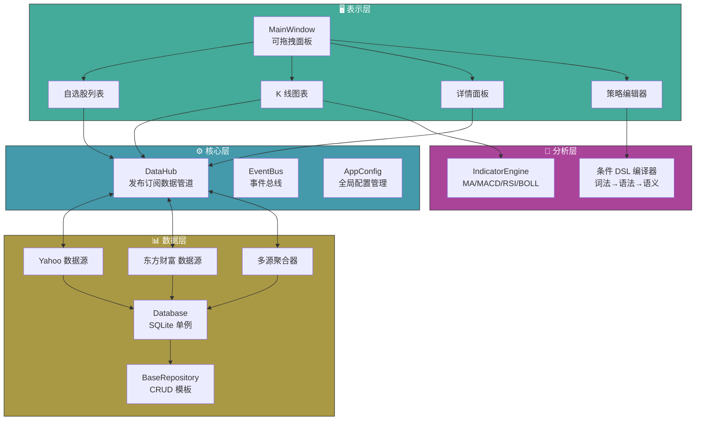
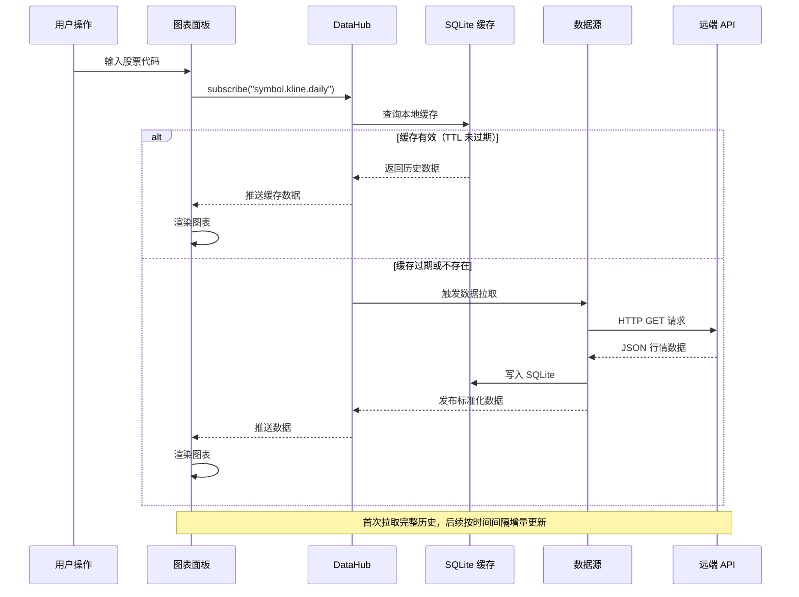
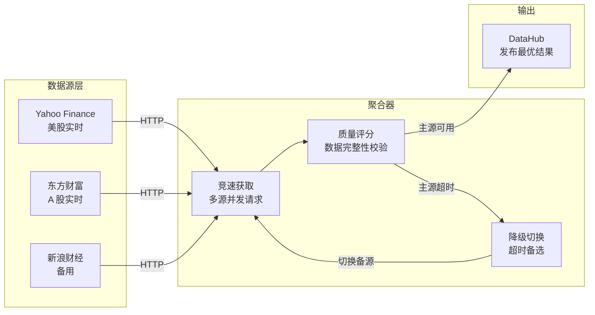
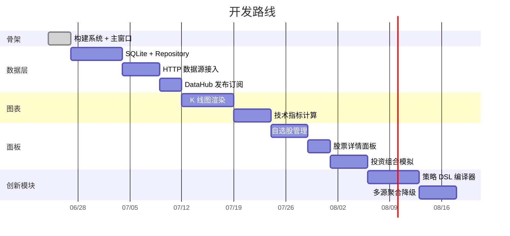

# FinInsight 项目设计文档

> C++20 / Qt6 桌面金融数据终端 — 架构设计与模块说明

---

## 一、项目概述

FinInsight 是一个基于 C++20 和 Qt6 的原生桌面金融数据终端。用户可以在统一的拖拽面板工作台中搜索股票、查看实时 K 线图表和技术指标、管理自选股列表，并进行模拟投资组合追踪。

**核心理念：** 将所有金融数据分析和展示能力集成到一个高性能的桌面应用中，利用原生 C++ 的图形渲染能力和 SQLite 本地缓存，提供流畅的离线可用的使用体验。

---

## 二、架构设计

### 2.1 技术栈

| 层级 | 技术 |
|------|------|
| 语言 | C++20 |
| UI 框架 | Qt 6.7（Widgets + Charts + Network + Sql） |
| 数据库 | SQLite（WAL 模式） |
| 构建系统 | CMake 3.27 + Ninja |
| 面板布局 | Qt Advanced Docking System |
| JSON 解析 | nlohmann/json |
| 数据源 | Yahoo Finance / 东方财富 / 新浪财经 |

### 2.2 分层架构



### 2.3 设计模式应用

| 模式 | 应用场景 | 实现位置 |
|------|---------|---------|
| **Singleton** | 全局唯一实例 | AppConfig、Database、DataHub |
| **Repository** | 数据实体 CRUD 抽象 | BaseRepository<T> 模板基类 |
| **Pub-Sub** | 解耦数据生产者与消费者 | DataHub 订阅通道 |
| **Strategy** | 多数据源可替换接入 | IDataProducer 接口 + 各实现 |
| **Command** | 可撤销/可记录操作 | 全局命令面板 |
| **Producer-Consumer** | 数据拉取与 UI 消费 | DataHub 生产者 → 面板消费者 |

---

## 三、数据流设计

### 3.1 行情数据完整链路



### 3.2 多源聚合流程



---

## 四、模块设计

### 4.1 模块概览

| 模块 | 路径 | 核心职责 |
|------|------|---------|
| **app** | `src/app/` | 主窗口创建、面板注册、菜单 |
| **core** | `src/core/` | 全局配置、事件总线、基础抽象 |
| **storage** | `src/storage/` | SQLite 管理、Repository 模板、数据库迁移 |
| **datahub** | `src/datahub/` | 发布订阅管道、数据源生产者 |
| **network** | `src/network/` | HTTP 客户端、WebSocket 连接 |
| **charts** | `src/charts/` | K 线图表渲染、技术指标计算 |
| **panels** | `src/panels/` | 自选股列表、股票详情、投资组合 |
| **dsl** | `src/dsl/` | 策略条件编译器（词法/语法/语义） |

### 4.2 storage/ — 数据持久化

```
Database (单例)
├── SQLite WAL 模式（一写多读并发）
├── 主线程持有主连接
├── 工作线程通过 thread_local 克隆连接
└── 自动执行版本化迁移脚本

BaseRepository<T> (模板基类)
├── findById(id)      → std::optional<T>
├── findAll()         → QVector<T>
├── insert(entity)    → bool
├── update(entity)    → bool
└── remove(id)        → bool
```

**数据库表：**

```sql
-- stocks: 股票基础信息
CREATE TABLE stocks (
    symbol      TEXT PRIMARY KEY,
    name        TEXT,
    exchange    TEXT,
    currency    TEXT DEFAULT 'USD',
    last_price  REAL,
    updated_at  INTEGER
);

-- klines: K线数据（日线）
CREATE TABLE klines (
    symbol      TEXT NOT NULL,
    date        TEXT NOT NULL,
    open        REAL,
    high        REAL,
    low         REAL,
    close       REAL,
    volume      INTEGER,
    PRIMARY KEY (symbol, date)
);
CREATE INDEX idx_klines_symbol ON klines(symbol);

-- watchlist: 自选股
CREATE TABLE watchlist (
    symbol      TEXT PRIMARY KEY,
    added_at    INTEGER DEFAULT (strftime('%s','now')),
    note        TEXT
);

-- portfolio: 模拟交易记录
CREATE TABLE portfolio (
    id          INTEGER PRIMARY KEY AUTOINCREMENT,
    symbol      TEXT NOT NULL,
    trade_type  TEXT NOT NULL CHECK(trade_type IN ('BUY','SELL')),
    quantity    INTEGER NOT NULL,
    price       REAL NOT NULL,
    traded_at   INTEGER NOT NULL
);
```

### 4.3 datahub/ — 数据管道

DataHub 是系统的数据中枢，解耦数据生产者和消费者：

```
DataHub
├── subscribe(topic, callback)   → 注册订阅者
├── publish(topic, data)         → 广播给所有匹配的订阅者
├── subscribe-on-publish         → 新订阅者立即收到最近一条缓存数据
└── 通配符支持                    → "AAPL.*" 匹配所有 AAPL 子主题

数据源生产者:
├── YahooFinanceProducer     → 拉取美股历史/实时行情
├── EastMoneyProducer        → 拉取 A 股实时行情
└── AggregatedProducer       → 多源并发拉取 + 质量择优
```

### 4.4 charts/ — 图表渲染

```
KLineChartWidget (基于 QChartView)
├── QCandlestickSeries      ← K 线蜡烛图（红涨绿跌）
├── QLineSeries × N         ← 均线叠加 (MA5/MA10/MA20/MA60)
├── QDateTimeAxis           ← X 轴时间刻度
├── QValueAxis              ← Y 轴价格/指标刻度
├── 鼠标滚轮缩放 + 拖拽平移
└── 十字光标 (crosshair)

IndicatorEngine (静态计算类)
├── computeSMA(data, n)          → 简单移动平均
├── computeEMA(data, n)          → 指数移动平均
├── computeMACD(data)            → MACD + Signal + Histogram
├── computeRSI(data, period=14)  → 相对强弱指标
├── computeBollinger(data, n=20) → 布林带 (上轨/中轨/下轨)
├── computeKDJ(data)             → 随机指标
└── computeOBV(data)             → 能量潮
```

### 4.5 dsl/ — 策略条件编译器

允许用户用自然表达式定义策略触发条件：

```
输入: "MACD > Signal AND RSI < 30 AND Close > MA_20"

Phase 1 — Lexer (词法分析):
   扫描字符 → Token 序列
   [IDENT(MACD), GT, IDENT(Signal), AND,
    IDENT(RSI), LT, NUMBER(30), AND,
    IDENT(Close), GT, IDENT(MA), LPAREN, NUMBER(20), RPAREN]

Phase 2 — Parser (递归下降):
   Token 序列 → 抽象语法树 (AST)
         AND
        /    \
      AND    Cmp(>, Close, Call(MA,20))
     /    \
 Cmp(>,  Cmp(<,
 MACD,   RSI, 30)
 Signal)

Phase 3 — Evaluator (求值):
   遍历 AST → 调用 IndicatorEngine → 比较运算 → 返回 bool
   每个节点 visit 时查询实时数据，得到最终触发结果
```

---

## 五、目录结构

```
FinInsight/
├── CMakeLists.txt
├── CMakePresets.json
├── build.bat
├── src/
│   ├── CMakeLists.txt
│   ├── main.cpp
│   ├── app/
│   │   └── MainWindow.h / .cpp
│   ├── core/
│   │   ├── AppConfig.h / .cpp
│   │   └── EventBus.h / .cpp
│   ├── storage/
│   │   ├── Database.h / .cpp
│   │   ├── BaseRepository.h
│   │   ├── StockRepository.h / .cpp
│   │   └── migrations/
│   │       └── V001_Initial.h
│   ├── datahub/
│   │   ├── DataHub.h / .cpp
│   │   ├── QuoteData.h
│   │   ├── YahooProducer.h / .cpp
│   │   └── EastMoneyProducer.h / .cpp
│   ├── network/
│   │   └── HttpClient.h / .cpp
│   ├── charts/
│   │   ├── KLineChart.h / .cpp
│   │   └── IndicatorEngine.h / .cpp
│   ├── panels/
│   │   ├── StockListPanel.h / .cpp
│   │   ├── DetailPanel.h / .cpp
│   │   └── PortfolioPanel.h / .cpp
│   └── dsl/
│       ├── Token.h
│       ├── Lexer.h / .cpp
│       ├── Parser.h / .cpp
│       └── Evaluator.h / .cpp
└── resources/
    └── icons/
```

---

## 六、开发阶段规划



---

## 七、扩展方向

| 方向 | 描述 | 涉及技术 |
|------|------|---------|
| 实时推送 | WebSocket 接入实时行情流 | QWebSocket、心跳保活 |
| 主题系统 | 浅色/深色主题动态切换 | Qt StyleSheet、QSettings |
| 行情预警 | 价格突破阈值 → 系统托盘通知 | 定时器 + 条件求值 |
| 数据导出 | 自选表/回测结果导出 Excel | QXlsx 库 |
| 跨平台 | 编译 Linux/macOS 版本 | CMake 平台预设 |
| 本地 AI | 集成 Ollama，自然语言查询 | QProcess、本地 LLM API |
| 回测引擎 | 加载历史数据验证策略收益 | 事件驱动回测框架 |

---

> 文档版本: v1.0 | 最后更新: 2026-07-06
