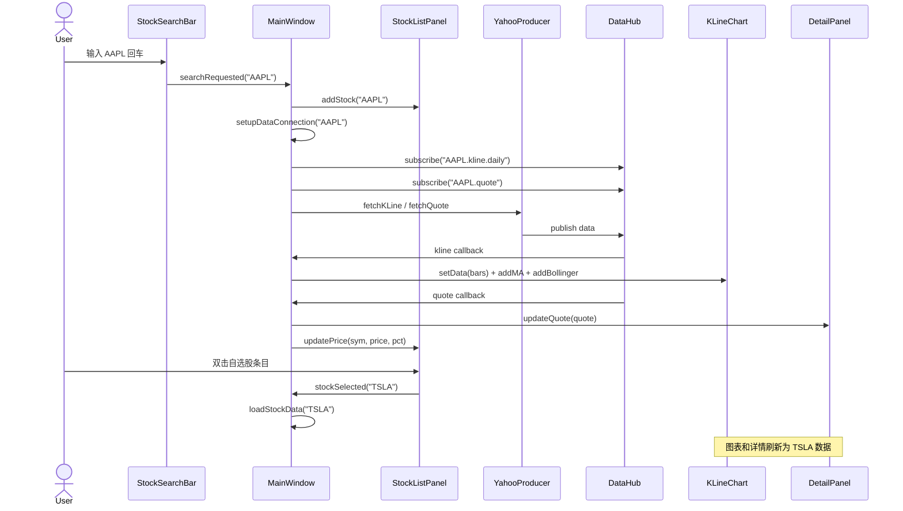

# Panels 模块文档

> 业务面板层：搜索框 + 自选股列表 + 详情 + 模拟投资组合

---

## 一、模块结构

```
src/panels/
├── StockSearchBar.h / .cpp    ← 顶部搜索框（回车触发）
├── StockListPanel.h / .cpp    ← 左侧自选股列表
├── DetailPanel.h / .cpp       ← 右侧股票详情
└── PortfolioPanel.h / .cpp    ← 底部模拟组合（框架）
```

---

## 二、界面布局

```
┌─────────────────────────────────────────────────────┐
│  [Enter stock symbol ...                    ] [×]  │  ← StockSearchBar
├──────────┬──────────────────────────┬───────────────┤
│ Watchlist│       Chart              │    Detail     │
│          │                          │               │
│ AAPL     │    ████                  │ Symbol: AAPL  │
│ TSLA     │   ██████                 │ Price: 187.5  │
│ MSFT     │    ████                  │ Change: +1.2% │
│          │   ██  ██                 │ Open:  186.3  │
│[Remove]  │     ██                   │ High:  188.2  │
│          │                          │ Low:   184.5  │
├──────────┴──────────────────────────┴───────────────┤
│ Portfolio                                           │
│ Cash: $100,000 | Holdings: $0 | P&L: $0             │
│ [Qty: 100] [Buy] [Sell]                             │
│ Symbol | Type | Qty | Price | Time                  │
└─────────────────────────────────────────────────────┘
```

---

## 三、数据流



---

## 四、各组件说明

### 4.1 StockSearchBar

```
职责：输入验证 + 回车触发搜索

规则：
  - 只接受 1-6 位字母/数字
  - 非法输入背景变红
  - 回车触发 searchRequested(symbol)

特性：
  - setClearButtonEnabled(true) → 右侧有 × 清空按钮
  - 自动转大写
```

### 4.2 StockListPanel

```
职责：维护自选股列表，双击切换，右键删除

交互：
  - 双击某行 → emit stockSelected(symbol) → K 线图刷新
  - 选中 + 按 Remove → 从列表移除
  - 价格变化 → 行文字变红(涨)/绿(跌)

存储：当前仅内存，未持久化到 SQLite（后续补）
```

### 4.3 DetailPanel

```
职责：展示当前选中股票的全部行情字段

字段：
  Symbol | Name | Price | Change | Change% |
  Open   | High | Low

价格行红涨绿跌
```

### 4.4 PortfolioPanel

```
职责：模拟交易面板（框架已搭建，功能待完善）

当前状态：
  - UI 完整（账户摘要 + 下单区 + 交易记录表）
  - 初始资金 $100,000
  - onBuyClicked / onSellClicked 空实现

后续完善：
  - 联动当前选中股票，自动填充价格
  - 实时计算浮动盈亏
  - 交易记录持久化到 SQLite
```

---

## 五、MainWindow 集成

```cpp
// MainWindow 持有所有面板的指针：
kline_chart_    → KLineChart     (中心)
stock_list_     → StockListPanel (左)
detail_panel_   → DetailPanel    (右)
portfolio_      → PortfolioPanel (下)
search_bar_     → StockSearchBar (顶)

// 信号连接：
search_bar_ → onSearchRequested() → 加自选 + 拉数据
stock_list_ → stockSelected()     → 切换股票 K 线
DataHub     → kline callback      → KLineChart.setData()
DataHub     → quote callback      → DetailPanel + StockListPanel 更新
```

---

## 六、使用示例

```
1. 顶部搜索框输入 "AAPL" 回车
   → 左侧自选股列表新增 AAPL
   → 中间 K 线图渲染 AAPL 半年日线
   → 右侧详情面板显示价格信息

2. 输入 "TSLA" 回车
   → 自选股列表新增 TSLA
   → K 线图和详情切换为 TSLA

3. 双击自选股列表中的 "AAPL"
   → 所有面板切换回 AAPL

4. 选中自选股，点 Remove
   → 从列表移除
```

---

> 文档版本: v1.0 | 最后更新: 2026-07-12
