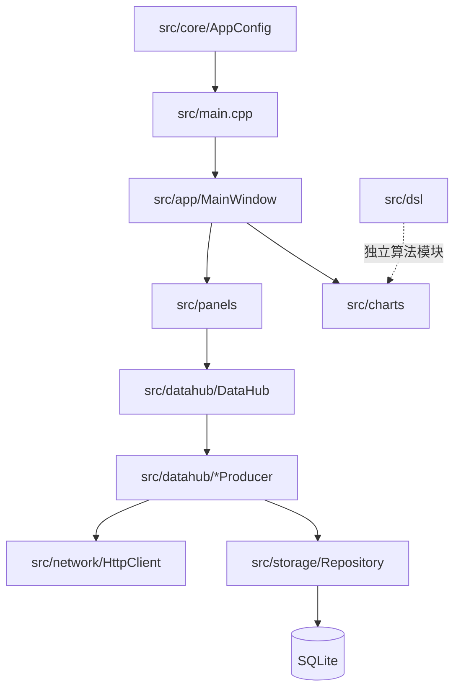
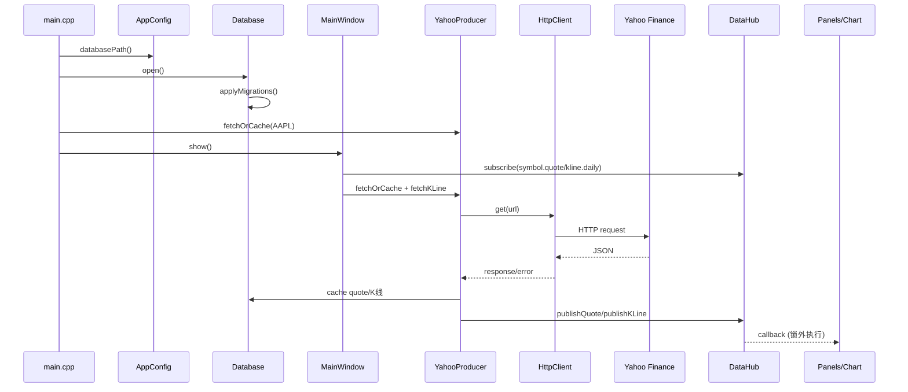
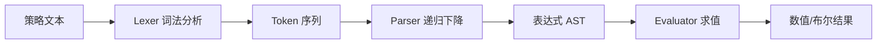
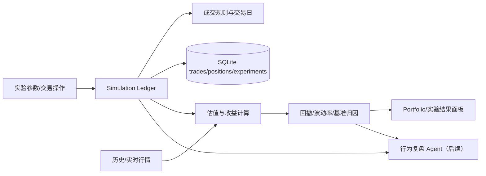

# FinInsight 项目架构与代码导览

> 面向第一次阅读项目的开发者。本文描述当前代码真实状态，`规划中` 不代表已经实现。建议先读本页，再按“启动链路 → 数据链路 → 文件索引”阅读源码。

## 1. 项目定位

FinInsight 是 C++20 + Qt6 Widgets 的桌面金融行情分析与模拟投资原型。当前主流程是：搜索股票 → 请求 Yahoo Finance → 解析报价/K 线 → 写入缓存并发布到进程内 DataHub → 面板和 K 线图刷新。模拟组合已具备内存交易闭环；历史实验 UI、DSL 回测和 AI Agent 仍属于演进方向。

## 2. 分层与依赖

依赖原则：UI 负责编排和展示；DataHub 负责进程内发布/订阅；Producer 负责数据源适配；HttpClient 负责 HTTP；Storage 负责 SQLite；charts/dsl 尽量保持可独立测试，不反向依赖 QWidget。

## 3. 启动与行情时序

`main.cpp` 启动时会额外拉取一次 AAPL；`MainWindow` 默认再次建立 AAPL 订阅和请求。切换股票时先取消旧订阅，再创建新主题订阅。

## 4. 数据模型与主题

`datahub/QuoteData.h` 定义跨模块传输的 `QuoteData`（symbol/name/price/change/open/high/low 等）和 `KLineData`（时间、OHLC、成交量）。`main.cpp` 使用 `qRegisterMetaType` 使它们可以放入 `QVariant`。

DataHub 主题约定：

| 主题 | 数据 | 用途 |
|---|---|---|
| `<symbol>.quote` | `QuoteData` | 详情、自选股、状态栏 |
| `<symbol>.kline.daily` | `QVector<KLineData>` | K 线图和指标 |
| `*.quote` | `QuoteData` | 通配报价订阅 |

DataHub 会保存每个主题最后一条数据；新订阅默认回放缓存。发布时先复制匹配回调，再在锁外执行，允许回调中再次订阅。

## 5. 文件级索引

### 5.1 应用入口与核心

| 文件 | 实现与职责 | 当前状态 |
|---|---|---|
| `src/main.cpp` | 创建 `QApplication`，注册元类型，打开数据库，启动 AAPL 生产者和 `MainWindow` | 已接入 |
| `src/CMakeLists.txt` | 定义可执行目标、Qt 模块、源文件清单及 Qt ADS FetchContent 依赖 | 已接入 |
| `src/app/MainWindow.h`、`src/app/MainWindow.cpp` | 主窗口、菜单、状态栏、Qt Advanced Docking 面板编排；连接搜索、自选股和 DataHub | 已接入 |
| `src/core/AppConfig.h`、`src/core/AppConfig.cpp` | 单例配置；计算应用数据目录和 SQLite 路径 | 已接入 |

### 5.2 行情数据管道

| 文件 | 实现与职责 | 当前状态 |
|---|---|---|
| `src/datahub/QuoteData.h` | `QuoteData`/`KLineData` 传输结构；日线可保存可选复权收盘价 | 已接入 |
| `src/datahub/HistoricalPriceAdapter.h`、`src/datahub/HistoricalPriceAdapter.cpp` | 将 Qt K 线桥接到严格校验的实验价格序列 | 已接入 ExperimentPanel；独立测试覆盖 |
| `src/datahub/DataHub.h`、`src/datahub/DataHub.cpp` | 单例发布/订阅、主题通配、最后值回放、线程锁 | 已接入 |
| `src/datahub/YahooProducer.h`、`src/datahub/YahooProducer.cpp` | Yahoo quote/chart JSON 请求、解析、缓存优先策略，并发布标准数据 | 主流程使用 |
| `src/datahub/QuoteAdapters.h`、`src/datahub/QuoteAdapters.cpp` | Yahoo/EastMoney/Sina URL 构建与报价 JSON 适配 | 共享适配器 |
| `src/datahub/EastMoneyProducer.h`、`src/datahub/EastMoneyProducer.cpp` | EastMoney 异步报价适配器，输出统一报价信号 | 独立原型；已迁移异步 HTTP |
| `src/datahub/Aggregator.h`、`src/datahub/Aggregator.cpp` | 基于异步 HttpClient 并发请求 Yahoo/EastMoney/Sina，校验首个有效报价并取消其余请求 | 异步原型；尚未接入主流程 |

### 5.3 网络与持久化

| 文件 | 实现与职责 | 当前状态 |
|---|---|---|
| `src/network/HttpClient.h`、`src/network/HttpClient.cpp` | 基于 `QNetworkAccessManager` 的 HTTP 封装；异步请求提供响应、超时、取消和 context 线程回调 | Producer/Aggregator 已异步；旧同步接口仅供兼容 |
| `src/storage/Database.h`、`src/storage/Database.cpp` | SQLite 单例连接、WAL/PRAGMA、事务、按线程克隆连接、迁移执行 | 已接入 |
| `src/storage/Migration.h` | 迁移版本号、描述和升级函数的数据结构 | 已接入 |
| `src/storage/migrations/V001_Initial.h` | 创建 stocks、klines、watchlist 等初始表 | 已接入 |
| `src/storage/BaseRepository.h` | 模板化 CRUD/查询辅助，封装 SQL 参数绑定 | 可复用基础设施 |
| `src/storage/StockRepository.h`、`src/storage/StockRepository.cpp` | `Stock` 实体及股票基础信息、报价/K线缓存读写 | 已接入部分 |

### 5.4 图表与指标

| 文件 | 实现与职责 | 当前状态 |
|---|---|---|
| `src/charts/KLineChart.h`、`src/charts/KLineChart.cpp` | `QChartView` K线绘制、缩放、十字线/提示及 MA、BOLL 系列 | 已接入主界面 |
| `src/charts/IndicatorEngine.h`、`src/charts/IndicatorEngine.cpp` | 纯算法计算 MA、EMA、MACD、BOLL、RSI、KDJ 等结果结构 | 独立模块；部分指标接入 |

### 5.5 DSL 策略模块

| 文件 | 实现与职责 | 当前状态 |
|---|---|---|
| `src/dsl/Token.h` | TokenType 枚举与 Token 结构 | 已实现 |
| `src/dsl/Lexer.h`、`src/dsl/Lexer.cpp` | 数字、标识符、运算符和括号扫描 | 已实现 |
| `src/dsl/Parser.h`、`src/dsl/Parser.cpp` | 递归下降解析二元、数字、标识符、函数表达式 | 已实现 |
| `src/dsl/Evaluator.h`、`src/dsl/Evaluator.cpp` | 基于上下文求值 AST，提供错误信息 | 已实现；尚未接入回测 |

### 5.6 用户面板

| 文件 | 实现与职责 | 当前状态 |
|---|---|---|
| `src/panels/StockSearchBar.h`、`src/panels/StockSearchBar.cpp` | 股票代码输入、回车校验并发出 `searchRequested` | 已接入 |
| `src/panels/StockListPanel.h`、`src/panels/StockListPanel.cpp` | 自选股列表，添加、删除、双击选中、更新价格 | 已接入；内存状态 |
| `src/panels/DetailPanel.h`、`src/panels/DetailPanel.cpp` | 8 行行情字段表格，响应 `QuoteData` | 已接入 |
| `src/panels/PortfolioPanel.h`、`src/panels/PortfolioPanel.cpp` | 10 万美元模拟账户、当前报价买卖、手续费、交易记录、持仓估值和盈亏展示 | 已接入 Ledger；状态仅在内存中 |

### 5.7 市场规则与模拟账本

| 文件 | 实现与职责 | 当前状态 |
|---|---|---|
| market/QuoteRules.h/.cpp | 纯 C++ 标的规范化、数据源路由、报价校验和错误汇总 | 已实现；独立测试覆盖 |
| simulation/Ledger.h/.cpp | 纯 C++ 虚拟现金、成交、持仓成本、手续费和盈亏计算 | 已接入 PortfolioPanel；SQLite 尚未接入 |
| `src/panels/ExperimentPanel.h`、`src/panels/ExperimentPanel.cpp` | 历史买入持有实验输入、K 线价格口径选择、收益率/回撤结果展示 | 已接入 MainWindow；结果仅在内存中 |
| simulation/InvestmentExperiment.h/.cpp | 纯 C++ 单标的历史买入持有实验，计算实际成交/估值边界、收益和最大回撤 | 核心已实现；由 Qt 实验面板调用 |
| simulation/HistoricalPriceSeries.h/.cpp | 校验标的、ISO 交易日、顺序和收盘价/复权价口径，生成实验 `PricePoint` | 核心已实现；Qt 桥接和独立测试覆盖 |

## 6. 当前组合模拟的真实边界

`PortfolioPanel` 接收 MainWindow 当前标的和最新报价，调用唯一的 `simulation::Ledger` 执行买卖并展示现金、持仓市值、总权益、已实现/未实现盈亏、收益率和账本交易记录。面板不重复成交计算。`ExperimentPanel` 则接收 K 线并运行历史买入持有实验。两类状态仍只在内存中，SQLite 尚未接入。

建议未来链路：

## 7. 新人推荐阅读顺序

1. `src/main.cpp`：确认生命周期和初始化顺序。
2. `src/app/MainWindow.cpp`：看面板装配、订阅和搜索切换。
3. `src/datahub/QuoteData.h`、`DataHub.cpp`：理解数据契约和主题。
4. `src/datahub/YahooProducer.cpp`、`src/network/HttpClient.cpp`：理解外部数据如何进入系统。
5. `src/charts/KLineChart.cpp`、`IndicatorEngine.cpp`：理解绘图和指标。
6. `src/storage/Database.cpp`、`StockRepository.cpp`：理解缓存和迁移。
7. `src/dsl`：最后阅读独立的策略表达式模块。

## 8. 修改时的检查清单

- 新行情源必须转换为 `QuoteData/KLineData`，通过 DataHub 或明确的 signal 输出，不能让面板解析供应商 JSON。
- 新 SQL 先加 migration，再更新实体和 Repository；不要在线程间共享同一个 `QSqlDatabase`。
- 新指标优先写成无 UI 的纯函数，并添加短输入、空输入和异常输入测试。
- QWidget 不应直接承担网络重试、长 SQL 或回测计算。
- 涉及模拟交易的结果必须记录输入、价格口径、时间范围和手续费，确保可复现；界面需标注模拟性质。

## 当前实验 UI 状态

`ExperimentPanel` 已连接 MainWindow 的 K 线回调，按 `HistoricalPriceAdapter -> HistoricalPriceSeries -> InvestmentExperiment` 运行单标的买入持有实验，并展示成交边界、期末权益、收益率和最大回撤。实验参数和结果目前只保存在内存中，SQLite 快照尚未实现。

WebSocket 传输层由 `network::WebSocketClient` 提供，当前已有实验性的 `YahooWebSocketAdapter` 将 Yahoo streamer Protobuf ticker 转换为 `QuoteData` 并发布到 `<symbol>.quote.realtime`。连接、心跳、重连退避和原始消息转发通过本地 `QWebSocketServer` 回环测试验证；该适配器尚未接入 MainWindow 股票主链路，也不会绕过 Aggregator 和 DataHub 质量规则。

## 9. 相关文档

- [`QUICKSTART.md`](QUICKSTART.md)：十分钟上手和构建。
- [`DATAHUB.md`](DATAHUB.md)：发布/订阅接口细节。
- [`STORAGE.md`](STORAGE.md)：SQLite、迁移和 Repository。
- [`CHARTS.md`](CHARTS.md)：K线与指标。
- [`DSL.md`](DSL.md)：表达式语法和求值。
