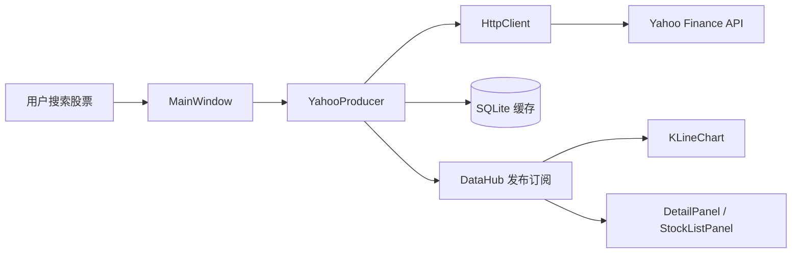
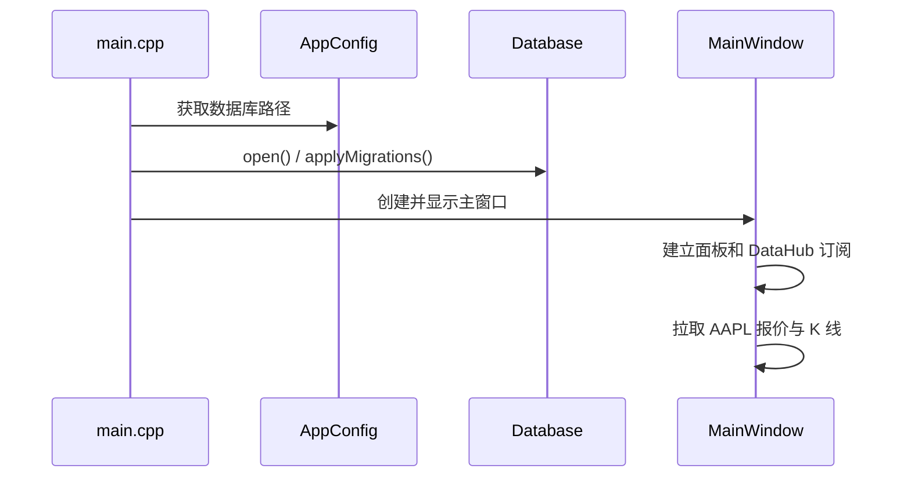

# FinInsight 快速上手与架构导览

这份文档面向第一次接触仓库的开发者。目标是让你在十分钟内知道程序从哪里启动、数据如何流动、每个目录负责什么，以及下一步应该在哪里改代码。

需要按模块和文件逐一了解实现时，请继续阅读 [`PROJECT_ARCHITECTURE.md`](PROJECT_ARCHITECTURE.md)。

## 1. 当前项目定位

FinInsight 是一个 C++20/Qt6 桌面行情分析原型，当前已经打通一条可运行的主链路：



项目目前是“可持续演进的基础版本”，而不是完整交易终端。DSL、指标计算、多源聚合器等模块已经存在，但部分尚未接入完整用户流程。

## 2. 启动路径



入口文件是 `src/main.cpp`。数据库在 UI 创建前初始化；主窗口初始化时默认加载 `AAPL`。

## 3. 目录职责

| 目录 | 责任 | 主要入口 |
|---|---|---|
| `src/app` | 主窗口、Dock 布局、跨面板编排 | `MainWindow` |
| `src/panels` | 面向用户的业务面板 | `StockListPanel`、`DetailPanel` |
| `src/datahub` | 行情数据模型、生产者、发布订阅、聚合 | `DataHub`、`YahooProducer` |
| `src/network` | HTTP 请求封装 | `HttpClient` |
| `src/storage` | SQLite 连接、迁移、Repository | `Database`、`StockRepository` |
| `src/charts` | K 线绘制与纯 C++ 指标算法 | `KLineChart`、`IndicatorEngine` |
| `src/dsl` | 策略表达式词法、语法和求值 | `Lexer`、`Parser`、`Evaluator` |
| `src/core` | 全局配置等横切基础设施 | `AppConfig` |

依赖方向应保持为：`panels/app -> datahub -> network/storage`，指标和 DSL 尽量保持独立，避免底层反向依赖 UI。

## 4. 本地构建

需要 Visual Studio 2022、Qt 6.7+（MSVC 64-bit）、CMake 3.27+ 和 Ninja。先修改 `CMakePresets.json` 中的 `CMAKE_PREFIX_PATH`，使其指向本机 Qt 安装目录，然后执行：

```powershell
cmake --preset win-dev
cmake --build --preset win-dev
```

如果依赖下载失败，优先检查 Qt 路径、Git 网络和 FetchContent 缓存。当前仓库没有提交构建产物，也没有 CI，因此“能否构建”必须在本机环境验证。

## 5. 常见修改入口

- 增加一个行情源：实现 `Producer` 的解析和错误信号，再通过 `DataHub::publishQuote()` 发布标准 `QuoteData`。
- 增加数据库字段：新增 migration，更新实体、Repository 的绑定顺序，并补迁移测试。
- 增加指标：先在 `IndicatorEngine` 写无 Qt 的纯函数，再在图表层添加系列。
- 扩展 DSL：按 `Lexer -> Parser(AST) -> Evaluator` 顺序修改，并为错误输入保留明确诊断。
- 修改界面：在 `panels` 中实现局部行为，由 `MainWindow` 负责面板编排，不要把网络和 SQL 直接写进 QWidget。

## 6. 当前已知边界

- 网络层仍包含同步请求封装，后续应统一为可取消的异步任务。
- `Aggregator` 已有并发任务原型，但尚未成为主流程，不能视为生产级竞速器。
- 组合交易面板目前是 UI 原型，买卖和持仓持久化尚未完成。
- DSL 尚未接入策略回测流程。
- 指标和解析器应优先通过单元测试覆盖后再扩展。

更详细的后续工作约束见 [`agent/README.md`](../agent/README.md)。
