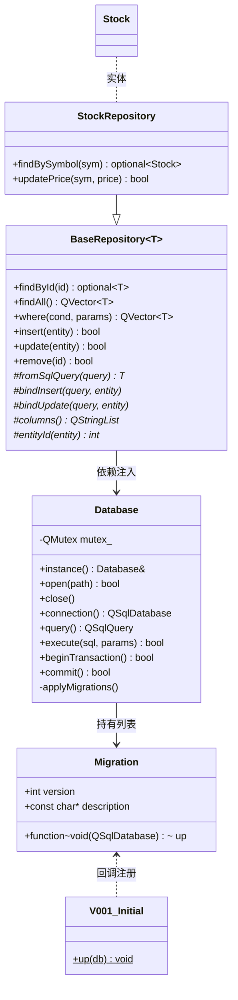
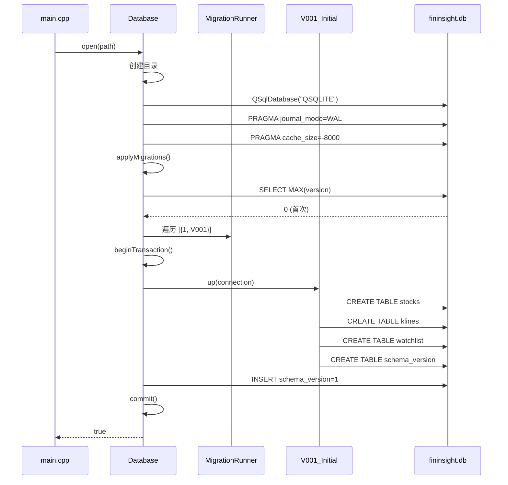
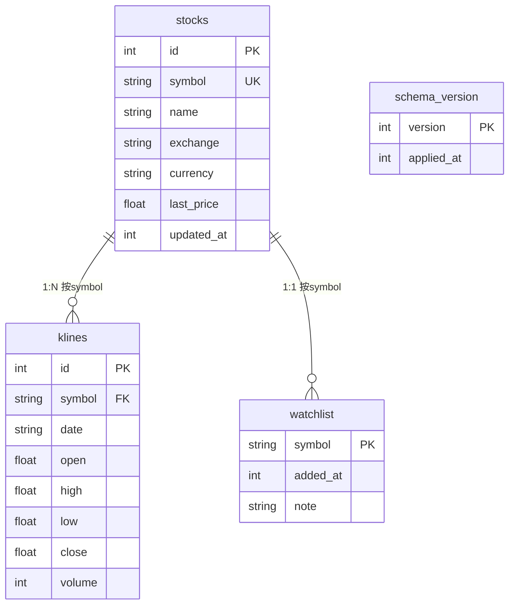

# Storage 模块文档

> 数据持久化层：SQLite 管理 + Repository 模板 + 版本化迁移

---

## 一、架构总览

```
src/storage/
├── Migration.h              ← 迁移框架结构体定义
├── Database.h / .cpp        ← 数据库管理器（单例）
├── BaseRepository.h         ← 通用 CRUD 模板基类
├── StockRepository.h / .cpp ← 股票数据仓储
└── migrations/
    └── V001_Initial.h       ← v1 建表脚本
```

---

## 二、类关系图



---

## 三、启动流程



---

## 四、数据库表结构



---

## 五、CRUD 调用示例

```cpp
#include "storage/Database.h"
#include "storage/StockRepository.h"

using namespace fininsight::storage;

// 1. 打开数据库（main.cpp 中已做）
Database::instance().open("path/to/fininsight.db");

// 2. 创建仓储
StockRepository repo(Database::instance());

// 3. 写入
Stock apple{"AAPL", "Apple Inc.", "NASDAQ", "USD", 187.5, time(nullptr)};
repo.insert(&apple);

// 4. 查询
auto maybe = repo.findBySymbol("AAPL");
if (maybe) {
    qDebug() << maybe->name << maybe->lastPrice;
}

// 5. 更新价格
repo.updatePrice("AAPL", 188.0);

// 6. 查询全部
auto all = repo.findAll();
qDebug() << all.size() << "stocks in database";
```

---

## 六、线程安全说明

```cpp
// 主线程：直接使用主连接
Database::instance().query();

// 子线程：自动克隆连接
void workerThread() {
    QSqlDatabase conn = Database::instance().connection();
    // conn 是一个新的数据库连接，指向同一个 .db 文件
    QSqlQuery q(conn);
    q.exec("SELECT * FROM stocks");
}
```

**原理：** 主连接在 open() 时创建，子线程调用 `connection()` 时通过 `QSqlDatabase::cloneDatabase()` 复制一个新连接。SQLite WAL 模式支持一写多读并发。

---

## 七、添加新表

```cpp
// 1. 新建 V002_Portfolio.h
namespace V002_Portfolio {
inline void up(QSqlDatabase db) {
    QSqlQuery q(db);
    q.exec("CREATE TABLE IF NOT EXISTS portfolio (...)");
}
}

// 2. Database.cpp 中 register：
{2, "Add portfolio", V002_Portfolio::up},

// 3. 创建 PortfolioRepository : BaseRepository<Portfolio>
// 重启程序自动迁移，老数据不受影响。
```
